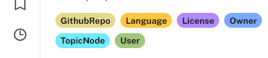
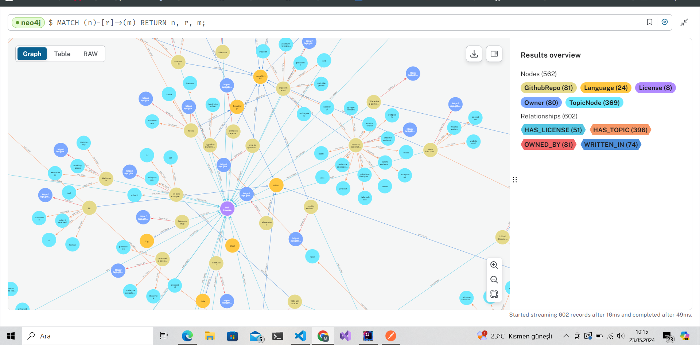
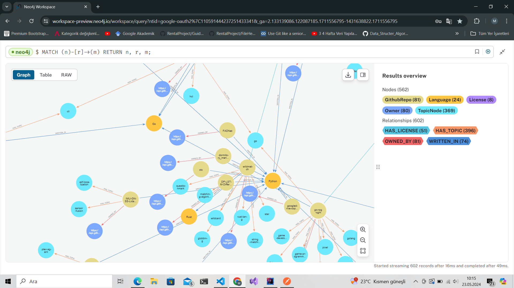
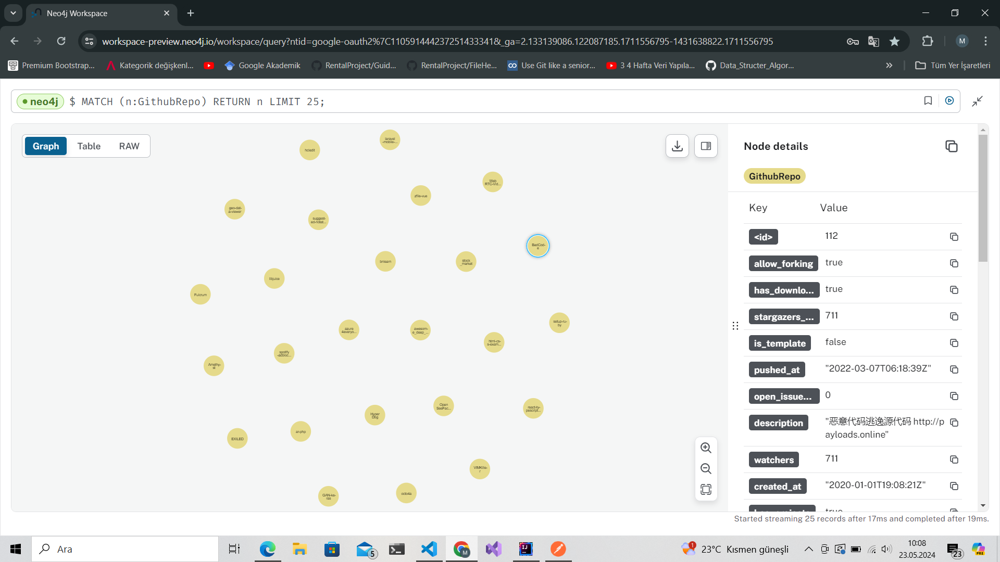
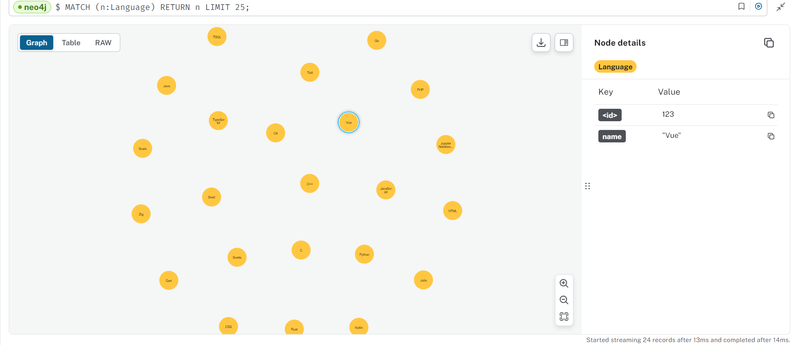
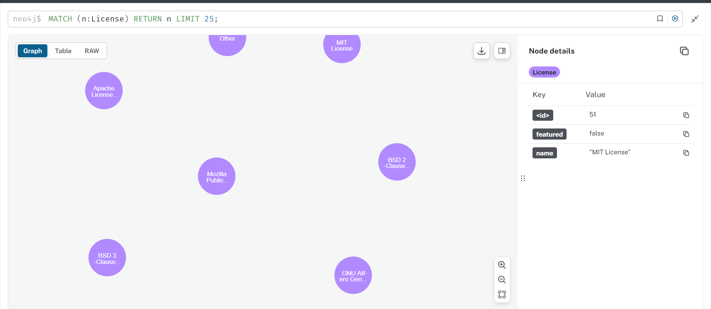

# My Java Project

Bu proje, modern Java teknolojileri kullanılarak geliştirilmiş bir uygulamadır. Bu README dosyası, projenin kurulumunu, kullanımını ve yapısını açıklamaktadır.

## İçindekiler

- [Proje](#proje)

## Proje

Aşağıda proje ile ilgili bazı görseller bulunmaktadır:

### All Node

### All Node and Relationship

### All Node and Relationship 2

### GitHub Repo Node

### Has License Relationship

### Has Topic Relationship

### Language Node

### License Node

### Owned By Relationship

